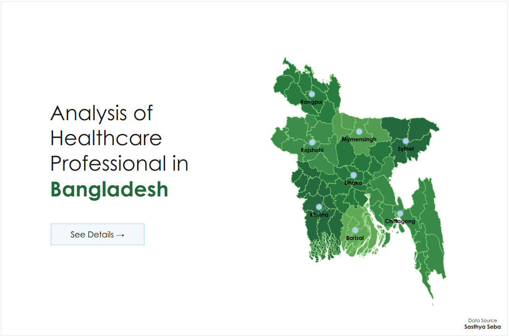

# Analysis of Healthcare Professionals in Bangladesh

An in-depth data analysis project examining the distribution, specialization, and experience patterns of healthcare professionals across Bangladesh using web scraping, data processing, and geospatial visualization techniques.

## 🚀 Quick Links

- **📊 [Live Tableau Dashboard](https://public.tableau.com/views/AnalysisofHealthcareProfessionalinBD/Home)** - Interactive visualization
- **💻 [GitHub Repository](https://github.com/faysalalmahmud/bd-med-professional-analysis)** - Source code and data
- **📝 [Data Source](https://sasthyaseba.com/)** - Sasthya Seba healthcare directory

## 📊 Project Overview

This project analyzes the healthcare professional workforce in Bangladesh by scraping data from Sasthya Seba (সাস্থ্য সেবা), processing it using Python, and creating interactive geographical visualizations using Tableau. The analysis provides insights into doctor distribution, specialization patterns, experience levels, and regional healthcare coverage.

    
## 🎯 Key Stats

- **Total Doctors Analyzed**: 6,047 healthcare professionals
- **Geographical Coverage**: All divisions of Bangladesh
- **Specialties Covered**: Top 10 medical specializations
- **Experience Range**: From new graduates to 30+ years of experience
- **Regional Distribution**: Dhaka division has the highest concentration with 5,151 doctors

## 📈 Visualizations

The project includes comprehensive visualizations showing:

1. **Specialty Analysis**
   - Average years of experience by medical specialty
   - Number of doctors by specialty
   - Degree distribution (MBBS, BDS, BCS, FCPS, etc.)

2. **Experience Distribution**
   - Doctor count by years of experience bins
   - Experience patterns across different specializations

3. **Geographical Analysis**
   - Interactive maps showing doctor distribution across Bangladesh
   - Division-wise healthcare professional density
   - Regional healthcare coverage patterns

## 🛠 Technologies Used

### Data Collection
- **Selenium**: Web scraping automation
- **Python**: Core programming language

### Data Processing
- **Pandas**: Data cleaning and manipulation
- **Jupyter Notebook**: Interactive data analysis environment

### Visualization
- **Tableau**: Interactive dashboard creation and geographical visualization
- **Bangladesh Subnational Boundaries**: Shapefile data from HDX

### Data Sources
- **Primary Data**: [Sasthya Seba](https://sasthyaseba.com/) - Healthcare professional directory
- **Geographical Data**: [Bangladesh COD-AB](https://data.humdata.org/dataset/cod-ab-bgd) - Administrative boundaries

## 📁 Project Structure

```
healthcare-analysis-bangladesh/
│
├── data/
│   ├── cleaned/
│   │   └── doctors_cleaned_data.csv        # Final cleaned dataset (6,047 records)
│   ├── combined/
│   │   └── doctors_combined_data.csv       # Combined raw data
│   └── raw/                                # Raw scraped data files
│       ├── doctors_raw_data(1_25).csv
│       ├── doctors_raw_data(26_50).csv
│       ├── doctors_raw_data(51_75).csv
│       ├── doctors_raw_data(76_100).csv
│       ├── doctors_raw_data(101_125).csv
│       ├── doctors_raw_data(126_150).csv
│       ├── doctors_raw_data(151_175).csv
│       ├── doctors_raw_data(176_200).csv
│       ├── doctors_raw_data(201_225).csv
│       ├── doctors_raw_data(226_250).csv
│       ├── doctors_raw_data(251_275).csv
│       └── doctors_raw_data(276_300).csv
│
├── notebooks/
│   └── Doctors_Data_Cleaning.ipynb        # Data processing and cleaning
│
├── src/
│   ├── __pycache__/                       # Python cache files
│   ├── data_combining.py                  # Script to combine raw data files
│   ├── scraper.py                         # Selenium web scraping script
│   └── tempCodeRunnerFile.py              # Temporary execution file
│
├── venv/                                  # Virtual environment
│
├── visualizations/
│   ├── screenshots/                       # Dashboard screenshots
│   │   ├── 1.png
│   │   ├── 2.png
│   │   ├── 3.png
│   │   └── 4.png
│   ├── Analysis of Healthcare Professional in BD__4924.twbr  # Tableau workbook
│   └── Analysis of Healthcare Professional in BD.twb        # Tableau dashboard
│
├── .gitignore                            # Git ignore file
├── README.md                             # Project documentation
└── requirements.txt                      # Python dependencies
```

## 🚀 Getting Started

### Prerequisites

```bash
pip install -r requirements.txt
```

Required packages:
- selenium
- pandas
- numpy
- jupyter
- webdriver-manager
- geopandas (for geographical analysis)

### Installation

1. Clone the repository:
```bash
git clone https://github.com/faysalalmahmud/bd-med-professional-analysis.git
cd bd-med-professional-analysis
```

2. Install dependencies:
```bash
pip install -r requirements.txt
```

3. Set up Chrome WebDriver for Selenium:
```bash
# WebDriver will be automatically managed by webdriver-manager
```

### Usage

1. **Data Collection** (Already completed - raw data files available):
   - Raw data collected in batches of 25 pages each
   - 12 separate CSV files containing scraped data

2. **Data Combining**:
```bash
python src/data_combining.py
```

3. **Data Processing and Analysis**:
```bash
jupyter notebook notebooks/Doctors_Data_Cleaning.ipynb
```

4. **View Visualizations**:
   - Open Tableau files in `visualizations/` folder
   - View screenshots in `visualizations/screenshots/`

## 📊 Data Schema

### Final Dataset Features

| Column | Description | Data Type |
|--------|-------------|-----------|
| `Doctor Name` | Full name of the healthcare professional | String |
| `Education` | Medical degree(s) and educational qualifications | String |
| `Speciality` | Medical specialization area | String |
| `Experience` | Years of professional experience | String/Integer |
| `Chamber` | Practice location/clinic name | String |
| `Location` | Geographical location/address | String |
| `Concentration` | Area of medical concentration/focus | String |

### Data Quality Metrics

- **Initial Dataset**: 6,520 records
- **Final Clean Dataset**: 6,047 records
- **Data Quality**: 92.7% retention rate
- **Missing Values**: Rows with missing values were removed to ensure data integrity
- **Duplicates**: Removed based on doctor name and qualification combination

## 🗺 Geographical Insights

### Division-wise Distribution

- **Dhaka Division**: 5,151 doctors (85.2%)
- **Chittagong Division**: 289 doctors (4.8%)
- **Sylhet Division**: Significant representation
- **Other Divisions**: Lower but consistent coverage

### Regional Healthcare Access

The analysis reveals significant healthcare professional concentration in urban areas, particularly in Dhaka, highlighting potential access disparities in rural regions.

## 📈 Key Findings

### Specialty Distribution
- **Immunologists**: Highest average experience (30 years)
- **Neurophysicians**: 25 years average experience
- **General Medicine**: Largest specialty group (579 doctors)
- **Aesthetic Medicine**: Growing specialty (512 doctors)

### Experience Patterns
- **Peak Experience Range**: 20-25 years
- **New Professionals**: Strong representation in 0-5 years category
- **Senior Professionals**: Concentrated in specialized fields

## 🔧 Technical Implementation

### Web Scraping Strategy
- **Pagination Handling**: 25 pages per iteration
- **Rate Limiting**: Implemented to respect website resources
- **Error Handling**: Robust exception management
- **Data Validation**: Real-time data quality checks

### Data Processing Pipeline
1. **Raw Data Extraction**: Selenium-based scraping from 12 separate batches
2. **Data Combination**: Merging all raw CSV files into a single dataset
3. **Data Cleaning**: Removing rows with missing values for data completeness
4. **Feature Standardization**: Consistent formatting across all columns
5. **Quality Assurance**: Final validation and duplicate removal
6. **Export**: Clean dataset preparation for visualization

## 🎨 Visualization Features

### 📊 Interactive Tableau Dashboard
**[View Live Dashboard on Tableau Public](https://public.tableau.com/views/AnalysisofHealthcareProfessionalinBD/Home?:language=en-US&:sid=&:redirect=auth&:display_count=n&:origin=viz_share_link)**

### Interactive Dashboard Elements
- **Geographical Heat Maps**: Doctor density by region across Bangladesh
- **Specialty Analysis**: Comparative charts showing doctor distribution by medical specialization
- **Experience Distribution**: Histogram analysis showing years of experience patterns
- **Degree Analysis**: Breakdown of educational qualifications (MBBS, BDS, BCS, FCPS, etc.)
- **Filtering Options**: Dynamic data exploration with interactive filters

### Design Principles
- **Color Scheme**: Professional green gradient representing healthcare
- **Accessibility**: Clear contrast and readable fonts
- **Interactivity**: Hover details and clickable map elements
- **Responsive Design**: Optimized only for desktop viewing

## 🤝 Contributing

Contributions are welcome! Please follow these steps:

1. Fork the repository: https://github.com/faysalalmahmud/bd-med-professional-analysis
2. Create a feature branch (`git checkout -b feature/AmazingFeature`)
3. Commit your changes (`git commit -m 'Add some AmazingFeature'`)
4. Push to the branch (`git push origin feature/AmazingFeature`)
5. Open a Pull Request

## 📄 License

This project is licensed under the MIT License.

## 🙏 Acknowledgments

- **Sasthya Seba**: For providing accessible healthcare professional data
- **Humanitarian Data Exchange**: For Bangladesh administrative boundary data
- **Open Source Community**: For the tools and libraries that made this project possible

## 📞 Contact

**Project Maintainer**: Faysal Al Mahmud
- GitHub: [@faysalalmahmud](https://github.com/faysalalmahmud)
- Repository: [bd-med-professional-analysis](https://github.com/faysalalmahmud/bd-med-professional-analysis)
- Tableau Dashboard: [Interactive Visualization](https://public.tableau.com/views/AnalysisofHealthcareProfessionalinBD/Home?:language=en-US&:sid=&:redirect=auth&:display_count=n&:origin=viz_share_link)

## 🔮 Future Enhancements

- [ ] Real-time data pipeline implementation
- [ ] Machine learning models for healthcare access prediction
- [ ] Mobile-responsive web application
- [ ] API development for data access
- [ ] Integration with government health databases
- [ ] Multilingual support (Bengali and English)

---

**Note**: This project is for educational and research purposes. Please respect the terms of service of data sources and use the information responsibly.

**Data Collection Date**: 16 Aug 2025  
**Last Updated**: 23 Aug 2025 
**Version**: 1.0.0


